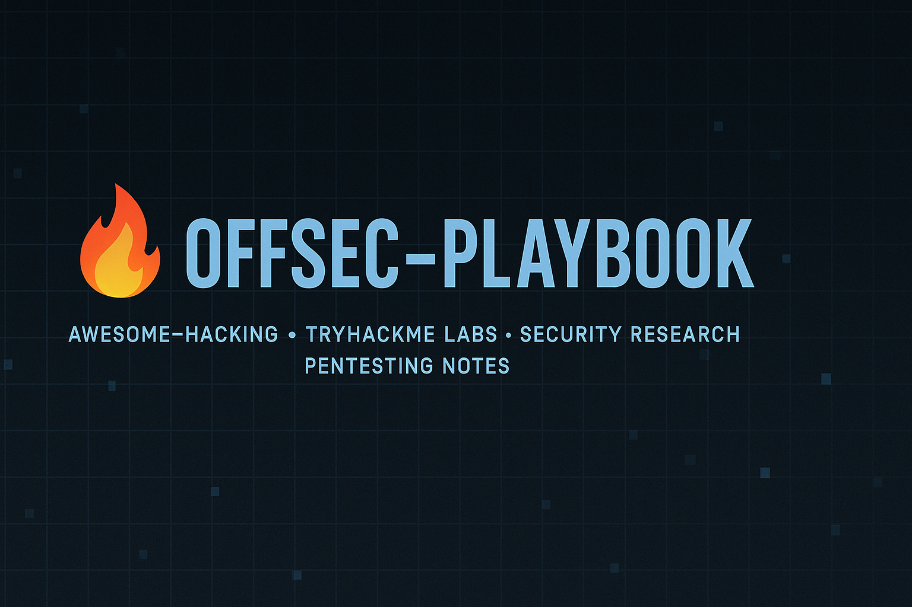

# 🔥 OFFSEC-PLAYBOOK

### *Awesome-Hacking • TryHackMe Labs • Security Research • Pentesting Notes*

  
  
  

  .svg" alt="Owner Badge"/>

 
# Github Stats:

<table align="center">
    <thead align="center">
        <tr border: 1px;>
            <td><b>🌟 Stars</b></td>
            <td><b>🍴 Forks</b></td>
            <td><b>🐛 Issues</b></td>
            <td><b>📏 Repo Size</b></td>
            <td><b>🔔 Open PRs</b></td>
            <td><b>🔕 Close PRs</b></td>
        </tr>
     </thead>
    <tbody>
         <tr>
            <td></td>
             <td></td>
            <td></td>
            <td></td>
            <td></td>
           <td></td>
        </tr>
    </tbody>
</table>

---

# 📡 Visitors Count

  

---

# 🧰 Tech Stack & Tools

  
  
  
  
  
  

---

# 🎯 Project Highlights

### 🔥 Why This Exists?
- To maintain structured hacking notes  
- To store TryHackMe & practical pentesting writeups  
- To keep command cheatsheets in one clean vault  
- To track learning progress & new techniques  
- To act as a personal *Offensive Security Playbook*

### 🏆 Goals
- Build a long-term knowledge base  
- Keep everything open-source & useful for others  
- Maintain consistency with markdown templates  
- Add automation (Markdown CI, link checks)

---

# 🧭 Directory Navigation (Quick Access)

| Section | Description |
|--------|-------------|
| 🔴 **TryHackMe/** | All labs, rooms, cheatsheets, and THM progress tracking |
| 🟢 **Asome-Hacks/** | Linux, network, web, misc hacking notes |
| 🔵 **New-Stuff/** | Experiments, research, drafts |
| 🟣 **assets/** | Images, banners, diagrams |
| 🟠 **templates/** | Writeup templates, cheatsheet templates |

---

# 📂 Folder Overview (Graphical)

  
  
  
  
  

---

# 📘 Docs & Templates

### 📝 Markdown Writeup Template  
Stored in: `templates/room-template.md`

### 🧪 Cheatsheets  
Available in:
